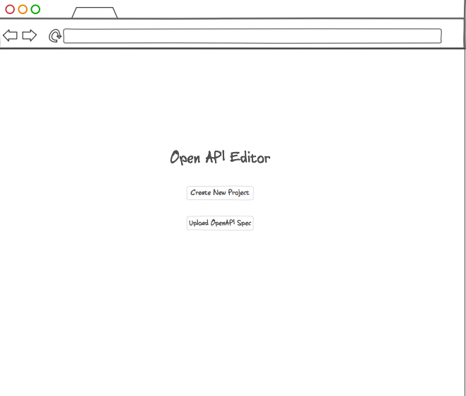
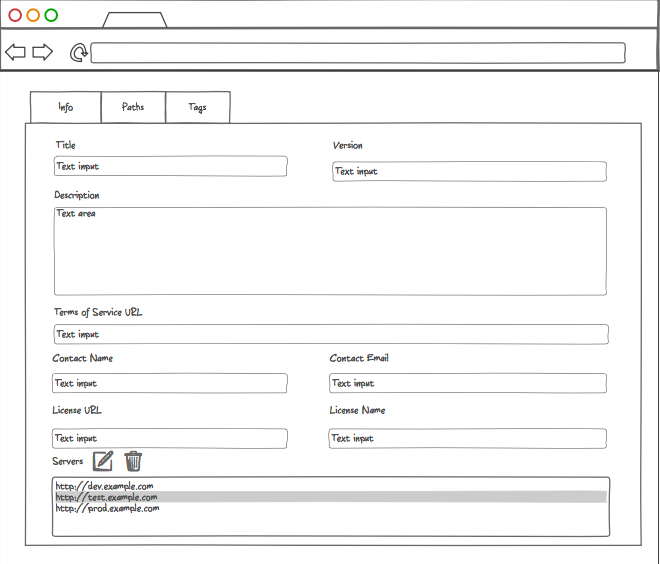

## Task 1:

#### Create new project and enter Info details:

The first page is simple as it'll ask the user to either create a new project or upload an existing spec.

Initially, we will only start with creating a new project.

When `Create New Project` button is clicked, the user will move to the second page which looks like this

The tabbed interface on the top will have multiple tabs. We'll only work with `Info` tab for this task.
